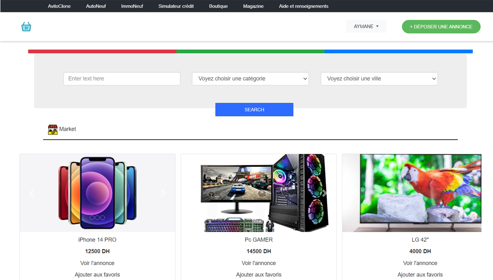
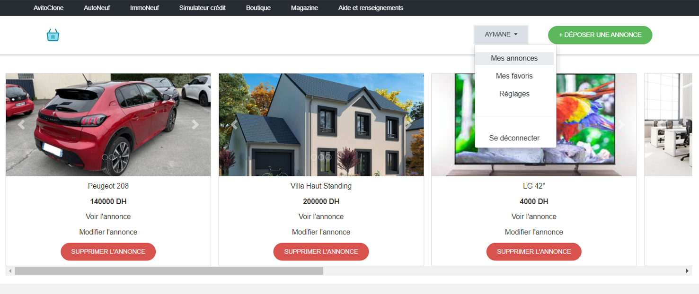

## AvitoClone README

**AvitoClone** is a classified ads website that closely resembles the design of www.avito.ma.


### Features

* **Homepage:**
    * Displays all ads grouped by category (Market, Real Estate, Vehicles...).
    * Each ad displays its associated images, title, price, and two links.
        * The first link, "Voir l'annonce" (View Ad), redirects to a page with more details about the product.
        * The second link, "Ajouter aux favoris" (Add to Favorites), allows users to add the ad to their favorites. If the user is not logged in, they will be prompted to log in before adding the ad to their favorites.
   
    * The homepage also offers a search bar with filters to apply (title, category, city...).
    * The homepage displays a navigation bar with links to different pages.
    * The navigation bar is displayed in two layouts: one for logged-in users and one for non-logged-in users.

* **User and their space:**
   
    * Allows users to create an account and post ads in the 4 product categories.
    * If a user is not logged in and tries to post an ad, they will be redirected to the login page.
    * After posting an ad, users can view all of their posted ads in the "Mes annonces" (My Ads) section, where they can edit or delete them.
    * Ads can be edited by changing the title, price, description, adding or removing images...
    * Another page is available for users, "Mes favoris" (My Favorites), where they can view and remove their favorites.
    * Users can also edit their information.

* **Ads:**
    * Each ad added to the database stores the ID of the user who posted it.
    * Users can add as many images as they want for an ad.
    * This page can only be accessed by logged-in users.
    * Ads can be edited as described above.
    * Once an ad is posted, it is displayed on the homepage and can be viewed by other users.

### Requirements

* Ruby on Rails
* PostgreSQL database

### Setup

1. Clone the repository:

```
git clone https://github.com/astronaum/AvitoClone
```

2. Install Ruby on Rails and PostgreSQL.

3. Create a database and configure it in the `database.yml` file.

4. Run `bundle install` to install the required gems.

5. Start the Rails server with `rails s`.

### Usage

1. Visit the homepage at `localhost:3000`.
2. Create an account or log in if you already have an account.
3. Post an ad or browse existing ads.
4. Edit or delete your ads as needed.
5. Add ads to your favorites or remove them from your favorites.
6. Edit your profile information.

### Notes

* This is a basic implementation of a classified ads website.
* More features can be added, such as a messaging system, a rating system, and a payment system.
